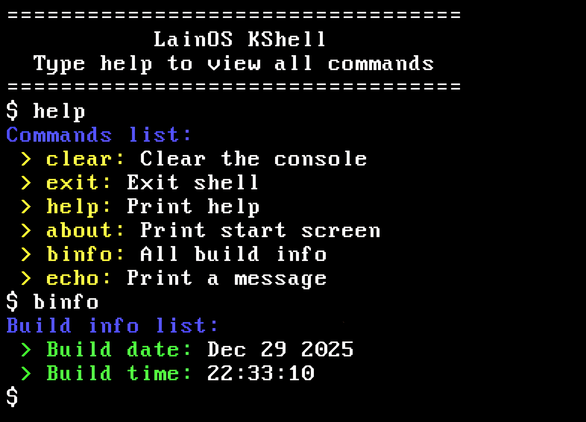

# Lain OS
**LainOS** is my very first attempt at creating an operating system. This project serves as a vital part of my learning journey in systems programming. 

The **LainOS** kernel operates in **32-bit mode** and is predominantly written in simple **C**, complemented by several sections of **Intel assembly**. 
The **bootloader** is a custom implementation tailored specifically for LainOS, developed in assembly language. My plan is to evolve it into a more feature-rich bootloader resembling GRUB in functionality. Currently, it is designed to support only **Legacy BIOS**, offering basic booting capabilities. In the future, I aim to add support for **UEFI**.

| KShell                  |
| ------------------------|
|  | 

## Documentation
A growing set of technical documents explaining the internals of the OS can be found here:
* [Documentation index](docs/index.md)
* [How to build](docs/build.md)

## Roadmap
| Component               | Status    | Notes / Dependencies |
| ----------------------- | --------- | -------------------- |
| Bootloader ( Base )     | Done      | — |
| Kernel                  | Done      | — |
| IDT                     | Done      | — |
| ISR / IRQ Manager       | Done      | IDT |
| PIC                     | Done      | IRQ Manager |
| Keyboard & VGA Drivers  | Done      | IRQs |
| Print Driver            | Done      | VGA driver |
| Test Kernel Shell       | Done      | Print Driver |
| Physical Memory Manager | Done      | Boot info |
| Virtual Memory          | InDev     | PMM, page fault handler |
| Memory Allocator        | Not yet   | PMM (used by pt allocation) |
| Timer (PIT/HPET)        | Not yet   | IRQs, needed for scheduler |
| Scheduler               | Not yet   | Timer, Context switcher |
| Context switcher        | Not yet   | Scheduler, task structures |
| Syscall                 | Not yet   | Context switcher, trap entry |
| User Mode               | Not yet   | Syscall, ELF loader, VM |
| ELF loader              | Not yet   | Filesystem or initramfs |
| File System             | Not yet   | Block device / ramfs |
| System Logs             | Not yet   | Print Driver / storage |
| Test user space shell   | Not yet   | User Mode, ELF loader, Init |
| Init System             | Not yet   | Filesystem, User Mode |

## License
This project is licensed under the GNU GPL v3.0 – see the LICENSE file for details.
